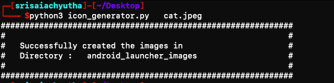

# **Requirements to run this file**

	python3 

	PIL  module while is also called as pillow
# **To download PILLOW module**
	use this command `pip3 install pillow` in macOS or linux
#Usage of this file

	python3  icon_generator.py   path_of_ur_image_file_to_be_converted

	
	
#Result
	if it is successfull it will create a 
	directory : android_launcher_images
